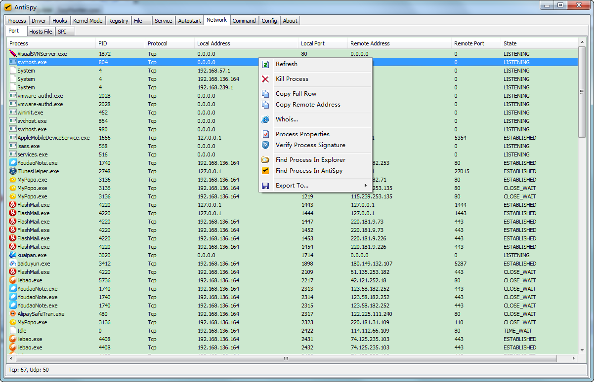

## Introduction

AntiSpy is a free but powerful anti virus and rootkits toolkit.

It offers you the ability with the highest privileges that can detect,analyze and restore various kernel modifications and hooks.

With its assistance,you can easily spot and neutralize malwares hidden from normal detectors.

## Development

* IDE: Visual Studio 2008
* Userspace: MFC
* WDK: WDK7600
* Third-party Library: codejock toolkit pro

## Code Structure

```
AntiSpy_Root_Dir
├── LICENSE                        
├── README.md    
├── doc                             (AntiSpy introduction files)
│   ├── Readme.txt 
│   └── 说明.txt
├── icon
│   └── icon.ico
├── src                               
│   ├── Antispy                     (AntiSpy main project)
│   │   ├── Common                  (The common structs&defines,used by userspace&kernel)
│   │   ├── SpyHunter               (Userspace project,written in MFC)
│   │   ├── SpyHunter.sln           (VS2008 solution file)
│   │   └── SpyHunterDrv            (Kernel project)
│   └── ResourceEncrypt             (Encryption tool project)
│       ├── ResourceEncrypt         (Encrypt driver and other resources)
│       ├── ResourceEncrypt.sln     (VS2008 solution file)
│       └── clear.bat
└── tools
    ├── ResourceEncrypt.exe        
    └── TestTools.exe               (Used to test the functionality of Antispy)
```

## Contact

Email: zhenfei.mzf@gmail.com

If you have any need,please feel free to contact with me.

## Features

Currently,the following features are available(including but not limited to):

### Process Manager

* Display system process and thread basic informations.
* Detect hidden processes,threads,process modules.
* Terminate, suspend and resume processes and threads.
* View and manipulate process handles,windows and memory regions.
* View and manipulate process hotkeys,privileges,and timers.
* Detect and restore process hooks incluing inline hooks,patches,iat and eat hooks.
* Inject dll,dump process memory.
* Create debug dump,inclue mini dump and full dump.

### Kernel Module Viewer

* Display kernel module basic information,include image base,size,driver object,and so on.
* Detect hidden kernel modules.
* Unload kernel modules.
* Dump kernel image memory.
* Display and delete system driver service informations.

### Hook Detector

* Detect and restore SSDT,Shadow SSDT,sysenter and int2e hooks.
* Detect and restore FSD and keyboard disptach hooks.
* Detect and restore kernel code hooks including kernel inline hooks,patches,iat and eat hooks.
* Detect and restore message hooks,both global and local.
* Detect and restore kernel ObjectType hooks.
* Display Interrupt Descriptor Table(IDT).

### Other Kernel Information Viewer

* View and remove kernel notifications.
* View filters for common devices include disk,volume,keyboard and network devices. 
* View IO timers,DPC timers,system threads,and so on.

### Registry Manager

* View and edit system registry.
* Detect hidden registry entries using live registry hive analysis.

### File Manager

* Display file basic information,include file name,size,attributes,and so on.
* Detect hidden files.
* View and delete locked files and folders.

### Service Manager

* Display system services basic informations.
* Control services status.
* Modify services startup type.

### Autorun Manager

* Display almost all kinds of system autorun types.
* Enable,disable or permanently delete autoruns.

### Network Viewer

* Display current network connections,include TCP and UDP informations.
* View and delete IE plugins and context menu.
* Display winsock providers(LSP).
* View and edit hosts file.

### Other Tools

* Hex Editor - View and edit memory,include ring3 process memory and ring0 system memory.
* Disassembler - Like OllyDBG,support ring3 process memory and ring0 system memory.

### Settings

* Custom color settings.

## Images

**Process Tree**


**Process Menu**


**Network**


**File Manager**


**AutoRun Manager**
